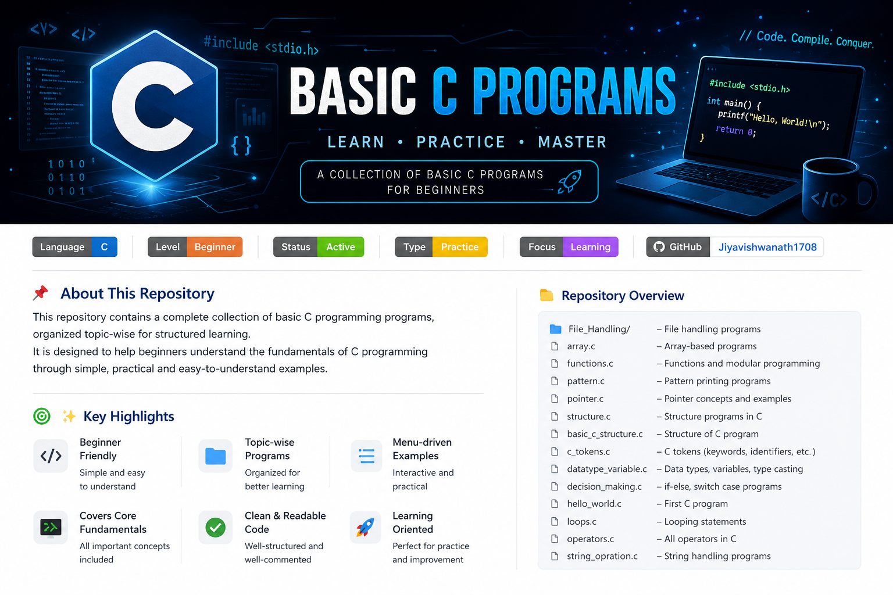

# 💻 Basic C Programs


Welcome to my C programming repository!
This repo contains simple and beginner-friendly C programs to understand basic concepts.

---

## This Repository Includes
---
1. Hello world code + C language History.
2. Basic C structure
3. Datatype & Variable
4. C Tokens
5. Operators
6. Desision making statements
7. Loops
8. string operations
9. Arrays
10. Patterns
11. pointers
12. structure 
13. functions
14. File handling
---
## 📌 Programs Included

# 💻 Basic C Programs

<p align="center">
  
</p>

<p align="center">
  Beginner-friendly C programs covering fundamental concepts from basic syntax to file handling.
</p>

<p align="center">
  
  
  
  
</p>

---

## 📂 Repository Structure

```
📦 Basic_C_Programs
├── 01_Basic_Concepts
├── 02_Arrays
├── 03_Patterns
├── 04_Functions
├── 05_Pointers
├── 06_Structures
├── 07_File_Handling
└── README.md
```

---

## 🛠️ Technologies Used

* Language: C
* Compiler: GCC
* IDE: VS Code

---

## 🎯 Learning Objectives

* Understand core concepts of C programming.
* Practice problem-solving through programs.
* Learn memory management using pointers.
* Work with structures and file handling.
* Build a strong foundation for Data Structures and Algorithms.

---

## ▶️ How to Run

Compile:

```bash
gcc filename.c -o output
```

Run:

```bash
./output
```

---

## 🌟 Highlights

✔ Beginner Friendly

✔ Well Organized Folder Structure

✔ Concept-wise Programs

✔ Practical Examples

✔ Portfolio Project

---

## 👨‍💻 Author

**Jiya Vishwanath**

---
✨ Keep Learning & Keep Coding!

